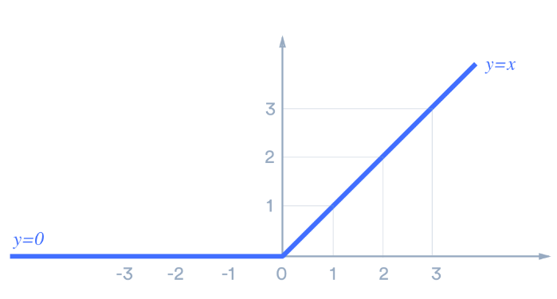

This is the first course of the specialzation, required 4 weeks' study, here list the week 1's main content:

- [Introduction to Deep Learning](#introduction-to-deep-learning)
   - [What is a Neural Network](#what-is-a-neural-network)
   - [Supervised Learning with Neural Networks](#supervised-learning-with-neural-networks)
   - [Why is Deep Learning taking off](#why-is-deep-learning-taking-off)

## Introduction to Deep Learning
Learning objective: 
> Understand the major trends driving the rise of deep learning.
> Be able to explain how deep learning is applied to supervised learning.
> Understand what are the major categories of models (such as CNNs and RNNs), and when they should be applied.
> Be able to recognize the basics of when deep learning will (or will not) work well.
### What is a Neural Network?
From lecture (a more figurative explanation through example):

A simple neural network: predict house price (Y) with house size (X). The circle which represents a single **neuron** in the neural network implements the predict function.

A larger neural network: predict house price (Y) with house size(x1), # of bedrooms(x2),zipcode(x3) and wealth(x4). Instead of predict by a single neuron, there is a **hidden layer** with multiple neurons to process the raw inputs.
Every input layer feature is interconnected with every hidden layer feature.

From other references (a more conceptive explanation):

> A neural network is a series of algorithms that endeavors to recognize **underlying relationships in a set of data** through a process that mimics the way the human brain operates. Neural networks can **adapt to changing input**; so the network generates the best possible result without needing to redesign the output criteria.

A typical neural network with more than 1 hidden layer looks like:

### Terminologies to take away:

**RELU**(Rectified Linear Unit),a type of activation function. Mathematically, it is defined as **y = max(0, x)**. Visually,it looks like: 

ReLU is the most commonly used activation function in neural networks, especially in CNNs.

**Activation function**.In artificial neural networks, the activation function of a node defines the output of that node given an input or set of inputs. With it, NN can learn and make sense of something really **complicated and Non-linear complex functional mappings** between the inputs and response variable.They introduce **non-linear properties** to our Network.

## Supervised learning with Neural Networks
### Supervised learning defination

From lecture: have some input X, learn a function mappping to some output Y.

Addition: Supervised learning infers a function from **labeled** training data consisting of a set of training examples. With constrast to **unsupervised learning**, which is modeling the underlying or hidden structure or distribution in the data,you only have input data and no corresponding output variables.

### Different types of Neural Networks for supervised learning:
- Standard NN (mainly used for structured data)
- CNN(Convolutional NN)(mainly used for computer vision)
- RNN(Recurrent NN)(mainly used for sequence data like audio/NLP)

### Structured and Unstructured data:
Structured data: basically databases of data. Each of the feature has a very well defined meaning.

Unstructured data:  has no pre-defined format or organization, making it much more difficult to collect, process, and analyze. like audio,image,text.
## Why is Deep Learning taking off

1. Data
  - For small traning sets, different algrithms can have similar performance. 
  - For larger traning sets, basically all different algrithms can have relatively higher performance than smaller data size,     but obviously medium/large NN dominating the other approches.
 2. Computation
 3. Algrithm
    Many algrithm innovations appeared when trying to make the NN run faster. Eg, change from sigmoid to Relu to address the     gradient vanishing problem.
 

