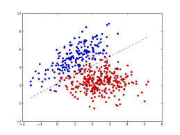
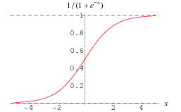
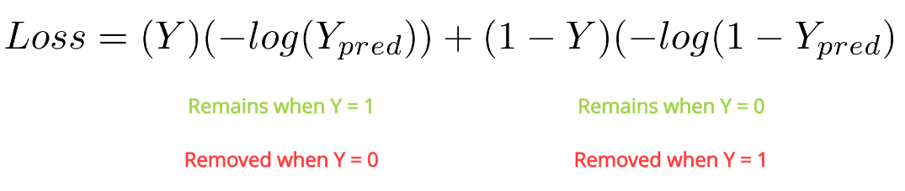
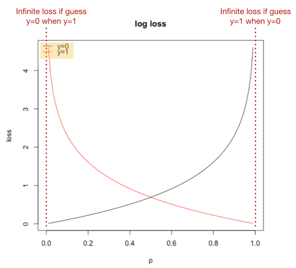
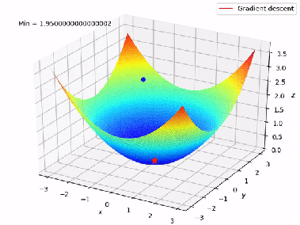
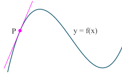
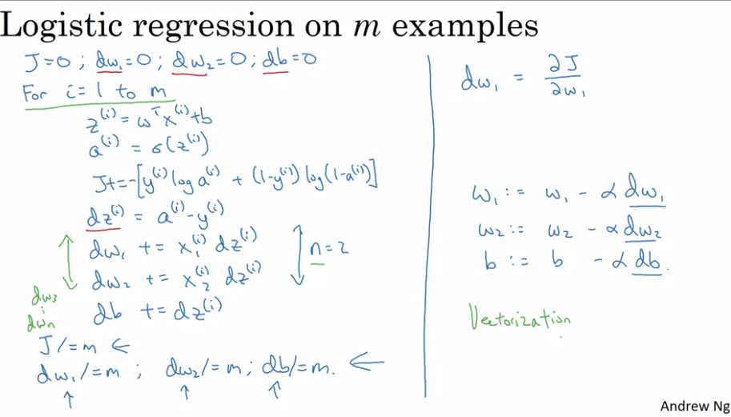

This is the week 2 materials for course 1. Here list the main contents:
- [Neural Network Basics](#neural-network-basics)
 - [Logistic Regression as a Neural Network](#logistic-regression-as-a-neural-network)
   - [Binary classification](#binary-classification)
   - [Logistic Regression](#logistic-regression)
   - [Logistic Regression Cost Function](#logistic-regression-cost-function)
   - [Gradient Descent](#gradient-descent)
   - [Derivatives](#derivatives)
   - [Computation Graph](#computation-graph)
   - [Logistic Regression Gradient Descent](#logistic-regression-gradient-descent)
   - [Gradient Descent on m examples](#gradient-descent-on-m-examples)
 - [Python and Vectrization](#python-and-vectorization)
   - [Vectorization](#vectorization)
   - [Vectorizing logistic regression](vectorizng-logistic-regression)
   - [Broadcasting in Python](#broadcasting-in-python)
   - [Note on Python and Numpy](#note-on-python-and-numpy)
# Neural Network Basics
> Learn to set up a machine learning problem with a neural network mindset. Learn to use vectorization to speed up your models.
## Logistic Regression as a Neural Network
### Binary Classification
Logistic Regression is an algrithm for binary classification. eg. input features of an image(x) to classify whether it's a cat (y=1) or not (y=0)

**Binary Classification**: the task of classifying the elements of a given set into two groups (predicting which group each one belongs to) on the basis of a classification rule.

   
   
Some notation rules:
- M: number of examples, M_train/M_test.
- X: uppercase X, reprensent the input of the whole training set, X.shape=(NX,M).NX is the number of input's features, eg,the pixel of images.
- Y: uppercase Y, represent the output of the whole training set, Y.shape=(NY,M).NY is the number of output's class, eg, is a cat or not.
### Logistic Regression
Logistic Regression is a learning algrithm used in a supervised learning when the output Y is either 0 or 1 (binary classification)

Given parameters W and real number b, simple linear regression will calaculate y_hat=W_transpose*x+b (which can be any value). But, for logistic regression which only expect 0/1,a sigmoid function is applied.
`y_hat= sigmoid(W_transpose*x+b)`

**Sigmoid function**

### Logistic Regression Cost Function
We need to define a cost function to tain the parameters W and b. The cost function is to measure how close is the predict y_hat to the ground truth y.

**Cost function vs Loss function**
Loss function is the error for a single training example. Cost function is the average of the loss function of the entire training set. So we talk about loss function first.

Use simple 'square error' for loss function seems not work well for logistic regression, as it leads to an non-convex optimation and thus may not able to finc the global optimal with gradient descent.

Instead we will use the **Cross-entropy loss function**. Let's explain why this loss function makes sense.

- if y=1: `L=-log(y_hat)`, if we want the loss to be small, then the `log(y_nat)` to be large, `y_hat` to be large, from above y_hat=sigmoid(W_transpose*x+b) with maxmium value close to 1
- if y=0: `L=-log(1-y_hat)`, want L to be small, then `log(1-y_hat)` to be large, `y_hat` to be small, y_hat with minimum close to 0.

From loss function to compute cost function: `J(w,b)=(1/m)*sum(l(y[i],y_hat[i])=-(1/m)*sum(y[i]log(y_hat[i])+(1-y[i])log(1-y_hat[i]))`
### Gradient Descent
> Gradient descent is an optimization algorithm used to minimize some function by iteratively moving in the direction of steepest descent as defined by the negative of the gradient.
We use gradient descent to learn the parameters W and b and thus minimize the cost.

Repeat: 

  `W := W-alpha*dw` (':=' means update W with; 'alpha' refers to learning rate, 'dw' is the partial derivtive of w on cost function J.
  
  `b := b-alpha*db`  ('db' is the partial derivative of b on cost function J)  
    
   derivative and partial derivative will be explained in next chapter.
### Derivatives
> In mathematics, the derivative is a way to show **rate of change**: that is, the amount by which a function is changing at one given point. For functions that act on the real numbers, it is the **slope** of the tangent line at a point on a graph.

>In mathematics, a partial derivative of a function of **several variables** is its derivative with respect to one of those variables, with the others held constant. 
Eg. J(w,b) with 2 variables(w,b), when consider dw,with b hold constant.
### Computation Graph
Computation graph for forward(left to right) process.

Computation graph for backward(right to left) process, also the computation for derivatives.

### Logistic Regression Gradient Descent
Eg. There is a traning example with 2 features `x1, x2`, parameters`w1,w2,b`.

### Gradient Descent on m Examples
In the above chapter, we calculate dw1,dw2 and db for a single traning example x[i] based on a loss function `L`.As follows:
`dz[i]=a[i]-y[i]`

`dw1[i]=x1[i]*dz[i]`

`dw2[i]=x2[i]*dz[i]`

`db[i]=dz[i]`

If there are `m` trianing examples in the traning set. With cost function `J=(1/m)*sum(L)`. Then,

`dw1=(1/m)*sum(dw1[i])`

`dw2=(1/m)*sum(dw2[i])`

`db=(1/m)*sum(db[i])`

There are 2 explicit inner loops in this algrithm: from 1 to m training examples; from w1 to wn feature wights. for loop will make the calculation rather slow for big dataset. Vectorization can get rif of such loops.
## Python and Vectorizaion
### Vectorization
Use **Numpy** (dot) libiary for vectorization. Eg, `z=np.dot(W_transpose,x)+b`

Neural network programming guideline: Whenever possible, avoid explicit for loops. Eg, V is a vector, want U to be exponential of every components of V. `U=np.exp(V)`
### Vectoring logistic regerssion
Vectorize Forward propagation:

`Z={z[1],z[2],z[3]...z[m]}={[w[1]_transpose*x[1]+b,w[2]_transpose*x[2]....}=W_transpose*X+b=np.dot(W_transpose,X)+b`

`A={a[1],a[2],a[3]...a[m]}={sigmoid(z[1]),sigmoid(z[2])...}=sigmoid(Z)`

lowercase repesent to single component, uppercase represent vector. b **broadcasting** to {b[1],b[2],...b[m]}

Vectorize backward propagtion (gradient descent):

`dZ={dz[1],dz[2]...dz[m]}={a[1]-y[1],a[2]-y[2],...}=A-Y`

`dw[i]={dw1[i],dw2[i],...dwn[i]}={x1[1]*dz[i],x2[2]*dz[i]...}=x[i]*dz[i]` (verctorize x[i] to get rid of the for-loop for w1 to wn features)

`dW=(1/m)*sum(dw[1],dw[2],...dw[m])=(1/m)*sum(x[1]*dz[1],x[2]*dz[2]...)=(1/m)*np.dot(X,dZ_transpose)`(vectorize dZ to get rid of the for-loop for 1 to m traning examples)

`dB=(1/m)*sum(db[1],db[2]...db[m])=(1/m)*sum(dz[1],dz[2]...)=(1/m)*sum(dZ)`
### Broadcasting in python

>The term broadcasting refers to how numpy treats arrays with different Dimension during arithmetic operations which lead to certain constraints, the smaller array is broadcast across the larger array so that they have compatible shapes.
`A is a m*n matix, B is a 1*n vector, C is a m*1 vector`

`if A "+,-,*,/" B, B will be copied m times (broadcasting) to be shape of m*n, then do the computation.`

`if A "+,-,*,/" C, C will be copied n times to be shape of m*n as well.`

Similar function in matlab/octave --bsxfun
### Note on python and numpy
Prevent to use **rank one array**, the matrix with shape like (n,).

Use `assert(a.shape ==(m,n))` to check if your matrix with the correct dimension. Use `a=a.reshape((m,n))` to correct the dimension.
