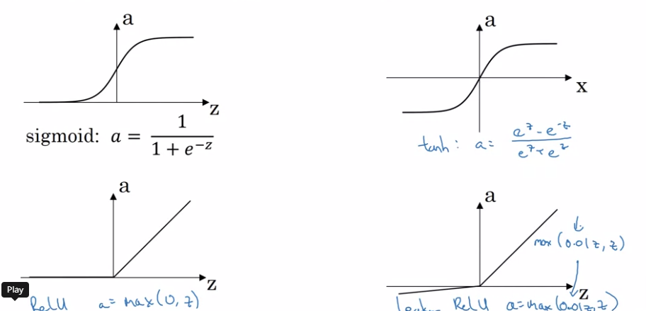

This is the 3rd week of first course, in this week, the learning objective is to : Learn to build a neural network with one hidden layer, using forward propagation and backpropagation. 
The main content of this week as follows:
- [Neural Networks Overview](#neural-networks-overview)
- [Neural Network Representation](#neural-network-representation)
- [Computing a Neural Network's output](#computing-a-neural-network-output)
- [Vectorizing across multiple examples](#vectorizing-across-multiple-examples)
- [Activation Function](#activation-function)
- [Why do we need non-linear activation functions](#why-do-we-need-non-linear-activation-function)
- [Derivatives of activation functions](#derivatives-of-activation-functions)
- [Gradient Descent for Neural Networks](#gradient-descent-for-neural-networks)
- [Backpropagation Intuition](#backpropagation-ntuition)
- [Random Initialization](#random-initialization)
## Neural Networks overview
From previous study, a simple logistic regression can be represented as:

`Z=W*X+b A=sigmoid(Z)`


A Neural Network with 1 hidden layer can be represented as (repeat logistic regression once):

`Z[1]=W[1]*X+b[1] A[1]=sigmoid(Z[1]) Z[2]=W[2]*A[1]+b[2] A[2]=sigmoid(Z[2])`


## Neural Network Representation
A NN can be divided by 3 different layers: **Input Layer**(X);**Output Layer**(Y); **Hidden Layer**(layers in bettwen, not visible)

`# layers NN` '#' is defined by `# of hidden layers + output layers` (Input layer not counted)
## Computing a neural network output
In this part, we only care about single traning example.

Notation convention: `a[l]j` refers to the jth node of lth layer


The top part calculate each node in hidden layer, while bottom part vectorizing x,W,b,Z,A.
```
x is the input, with shape(Nx,1)

W1 is the weight parameter of L1, with shape(NL1,NL0) (Nl refers to the # of node in layer l)

b1 is the bias parameter of L1, with shape(NL1,1)

Z1 is the linear output of L1, with shape(NL1,1)

A1 is the final output (after activation) of L1, with shape(NL1,1)

W2 is the weight parameter of L2, with shape(NL2,NL1)

b2 is the bias parameter of L2, with shape(NL2,1)

Z2 is the linear output of L2, with shape(NL2,1)

A2 is the final output of L2, with shape(NL2,1)
```

This rule can be generalized to 
```
W[l] with shape(Nl,N[l-1])

b[l] with shape(Nl,1)

Z[l] with shape(Nl,1)

A[l] with shape(Nl,1)
```

The output computed with vectorizing `y_hat=A2=sigmoid(Z2),Z2=W2*A1+b2,A1=sigmoid(Z1),Z1=W1*x+1`
## Vectorizing across multiple examples
In this part, take mutiple training examples into consideration. m refers to the number of traning examples.

notation convention: `a[l](i) refers to ith traning example in layer l`


The step by step calculation can be implemented with a for-loop:
```
for i=1 to m:
    Z[1](i)=W[1]*X[:,i]+b[1]
    A[1](i)=sigmoid(Z[1](i))
    Z[2](i)=W[2]*A[1](i)+b[2]
    A[2](i)=sigmoid(Z[2](i))
```
Vectoring X,Z and A:

```
X is the input, the whole training set, with shape (Nx,m)

Z[l] is the linear output of layer l, with shape(Nl,m)

A[l] is the final output of layer l ,with shape(Nl,m)
```
The output computed with vectorizing `y_hat=A2=sigmoid(Z2),Z2=W2*A1+b2,A1=sigmoid(Z1),Z1=W1*X+b1`
## Activation Function


| Function    | Pros | Cons|
| ----------- | ----------- | ----------- |
| Sigmoid      | useful in binary output | slow gradient descent when z is small/ large (slope close to 0) |
| tanh   | mean of output close to 0, centre data for next layer  | slow gradient descent when z is small/ large |
| RELU   | fast gradient descent as slope is linear when z is positive | slope close to 0 when z is negative |
|Leaky RELU | small slope (not 0) when z is negative | another learnable parameter to define -- slope when z is negative |

Principles of how to choose activation functions:

- Use sigmoid for binary classification (0/1), others Relu.
- Find the one better fit with your problem through try-out.
## Why do we need non linear activation function


